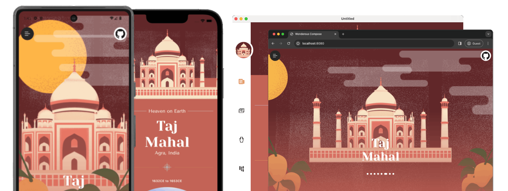
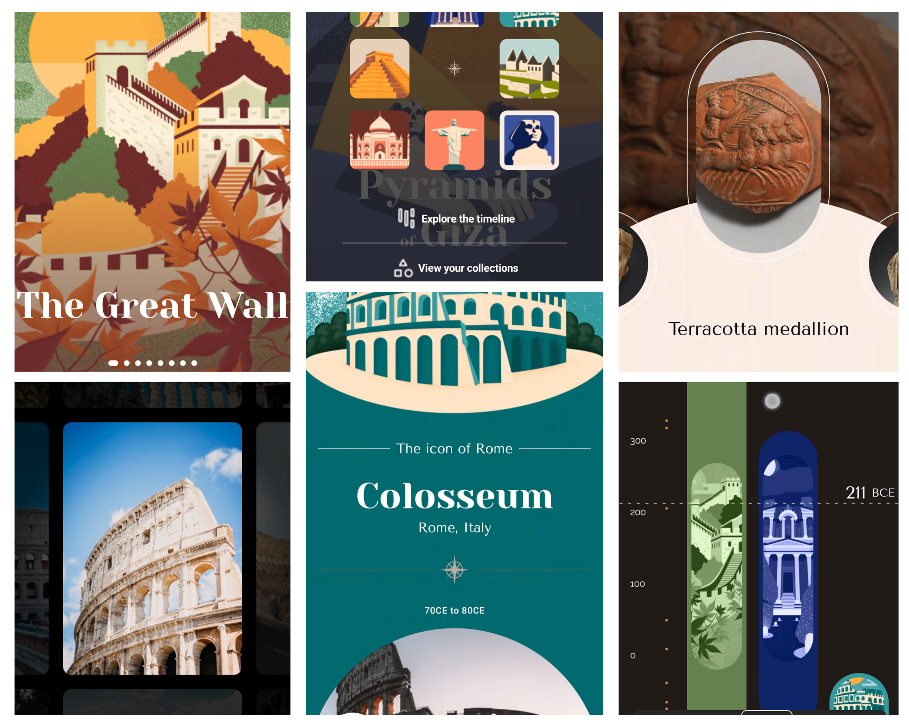

[](https://youtube.com/shorts/f-wM_MCiQmo?feature=share)

# Wonderous Compose

![badge android][badge-android]
![badge ios][badge-ios]
![badge linux][badge-linux]
![badge windows][badge-windows]
![badge macos][badge-macos]
![badge web javascript][badge-js]
![badge web wasm][badge-wasm]

Checkout live web version based on WASM here
[shreyashkore.github.io/wonderous-compose-wasm/](https://shreyashkore.github.io/wonderous-compose-wasm/)

For the version based on JS see
[shreyashkore.github.io/wonderous-compose-js/](https://shreyashkore.github.io/wonderous-compose-js/)

> Note: Some gestures do not work on the web/desktop platforms. For scrolling horizontally
> use `Shift + Scroll`.

> 🚧 WORK IN PROGRESS 🚧

> Contributions are welcome!

Wonderous Compose is a port of Wonderous
in [Compose Multiplatform.](https://www.jetbrains.com/lp/compose-multiplatform/)
Wonderous Compose is a visual showcase of eight wonders of the world.
The [original project](https://flutter.gskinner.com/wonderous/) was built
by team [gskinner](https://gskinner.com/flutter/)
using [Flutter.](https://flutter.dev/) This project is a tribute to their original
work, with an aim to explore the design possibilities with Compose.

Artworks and logos are taken from the original
project's [GitHub repo.](https://github.com/gskinnerTeam/flutter-wonderous-app)
Public-domain artwork from
[The Metropolitan Museum of Art, New Your.](https://www.metmuseum.org/about-the-met/policies-and-documents/open-access")
Photography from [Unsplash.](https://unsplash.com/@gskinner/collections)



## Outline

* [Home Screen](composeApp/src/commonMain/kotlin/ui/screens/home/HomeScreen.kt) shows the usage of
  HorizontalPager along with AnimatedVisibility for animating
  foreground and background elements.
* [ArtifactList Screen](composeApp/src/commonMain/kotlin/ui/screens/ArtifactListScreen.kt)
  uses [`ArtifactListViewModel`](composeApp/src/commonMain/kotlin/ui/screens/ArtifactListViewModel.kt)
  view model for business logic.
* [ArtifactDetails Screen](composeApp/src/commonMain/kotlin/ui/screens/ArtifactDetailsScreen.kt)
  demonstrates writing business logic in the UI layer itself.
* [Editorial Screen](composeApp/src/commonMain/kotlin/ui/screens/EditorialScreen.kt) uses LazyColumn
  layout and its scroll APIs to
  drive animations/transitions for elements
  when they appear on the screen.
* Map View demonstrates how KMP and Compose's interoperability layer can be used to embed native UIs
  in Compose.
    * For
      Android [Google Map compose](https://developers.google.com/maps/documentation/android-sdk/maps-compose)
      library is used.
    * For IOS [MKMapView](https://developer.apple.com/documentation/mapkit/mkmapview) is used.
    * For web [Wasm Html interop](https://github.com/Hamamas/Kotlin-Wasm-Html-Interop) library is
      used to draw DOM elements on canvas. This allows us to
      use [OpenLayers](https://openlayers.org/) for displaying OpenStreet maps.
    * For desktop; mapview-desktop module is
      copied from the official
      [compose samples](https://github.com/JetBrains/compose-multiplatform/tree/master/examples/imageviewer/mapview-desktop).
      This sample uses OpenStreetMap data to draw map tiles on Compose Canvas.
* The [Photo Gallery screen](composeApp/src/commonMain/kotlin/ui/screens/PhotoGalleryScreen.kt)
  makes use of a custom layout and also uses a custom gesture detection
  modifier.
* [Timeline screen](composeApp/src/commonMain/kotlin/ui/screens/timeline/TimelineScreen.kt)
  uses [`TimelineState`](composeApp/src/commonMain/kotlin/ui/screens/timeline/TimelineScreen.kt)
  which
  is kind of a view controller for managing state of timeline. It manages conversion
  of year to scroll position and vice versa.

## Libraries Used

- [Ktor](https://ktor.io/): HTTP networking
- [AndroidX Navigation](https://www.jetbrains.com/help/kotlin-multiplatform-dev/compose-navigation-routing.html):
  Navigation
- [Compose Image Loader](https://github.com/qdsfdhvh/compose-imageloader): Image Loading
- [compose-webview-multiplatform](https://github.com/KevinnZou/compose-webview-multiplatform):
  WebView for Android, IOS
  and Desktop
- [maps-compose](https://developers.google.com/maps/documentation/android-sdk/maps-compose): Maps on
  Android

## Source Sets

This project uses experimental DSL to configure custom hierarchy.

```kotlin
applyDefaultHierarchyTemplate {
    common {
        group("nonWeb") {
            withAndroidTarget()
            withNative()
            withJvm()
        }
        group("web") {
            withJs()
            withWasm()
        }
    }
}
```

Here 2 additional intermediate source sets are created to share code among web platforms.

- `nonWeb` contains all the targets except JS and WASM.
- `web` contains only the JS and WASM targets

## TODO

- [x] WASM support

- [ ] Collectibles and My Collection Screen

- [x] Localization

- [ ] Gesture support on Web and Desktop platforms

- [X] Shared Element Transition on the home screen

- [x] Haptics

## Set up the environment

> For compose multiplatform setup information
> checkout the
> [documentation](https://www.jetbrains.com/help/kotlin-multiplatform-dev/compose-multiplatform-setup.html).

- Add Google Maps key in `local.properties` at the project root.

```properties
MAPS_API_KEY=YOUR_KEY
```

- Add `key.properties` at the project root (For the lazy ones like me; Just remove `signingConfigs`
  and `keyProp` block from `composeApp/build.gradle.kts`).

```properties
storePassword=storePassword
keyPassword=keyPassword
alias=myKey
path=path/To/key.jks
```

[badge-android]: http://img.shields.io/badge/platform-android-6EDB8D.svg?style=flat

[badge-ios]: http://img.shields.io/badge/platform-ios-CDCDCD.svg?style=flat

[badge-js]: http://img.shields.io/badge/platform-js-F8DB5D.svg?style=flat

[badge-jvm]: http://img.shields.io/badge/platform-jvm-DB413D.svg?style=flat

[badge-linux]: http://img.shields.io/badge/platform-linux-2D3F6C.svg?style=flat

[badge-windows]: http://img.shields.io/badge/platform-windows-4D76CD.svg?style=flat

[badge-macos]: http://img.shields.io/badge/platform-macos-111111.svg?style=flat

[badge-wasm]: https://img.shields.io/badge/platform-wasm-624FE8.svg?style=flat
